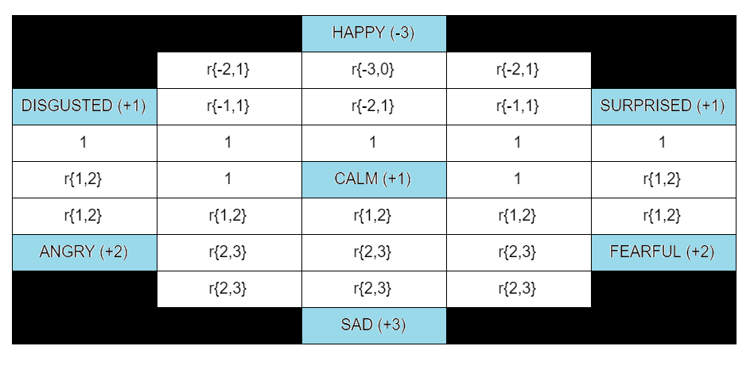

# UltimatumSimpleMind
Decision module for Ultimatum game, based on rules in Prolog.

### Rules:
Player can move only vertically and horizontally, the black squares are not part of the board. 
Acceptance of the offer by the opponent: 1 space towards happy (up). 
Rejection: 1 square down. 
Checking the emotions: when the opponent makes a proposal: the emotion shown on the face is 2 steps towards that emotion, and the emotion in the voice is 1 step towards it. (Reason: the person evaluates the interlocutor's emotions in 67% on the basis of microexpression and in 33% on the basis of the tone of the voice). 
R {x, y} is a random integer from the interval [x, y].

How the computer player makes decisions: 
Money sharing proposal 
The proposed amount is equal to the opponent's last proposal, reduced or increased by the value of the field on the board, if it is not a number greater than 9 or less than 1. Otherwise, the limits of the proposal range are 1 and 9. 
Rejection / Acceptance Decision 
The decision is made on the basis of the sign of the field we stand on (- is rejection, + is acceptance), and when the value of the field is 0, the proposal is rejected.
